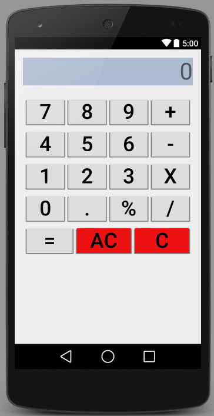
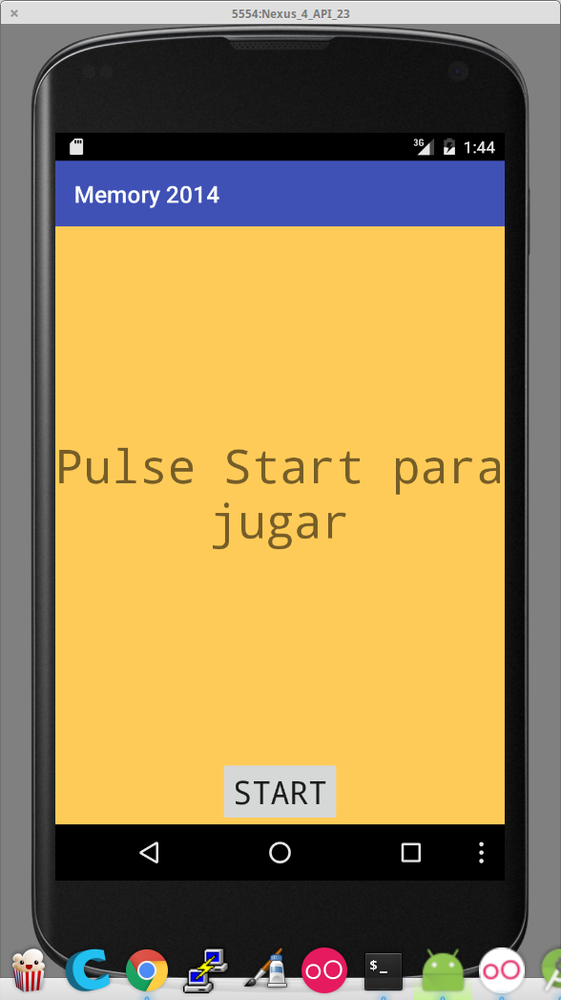
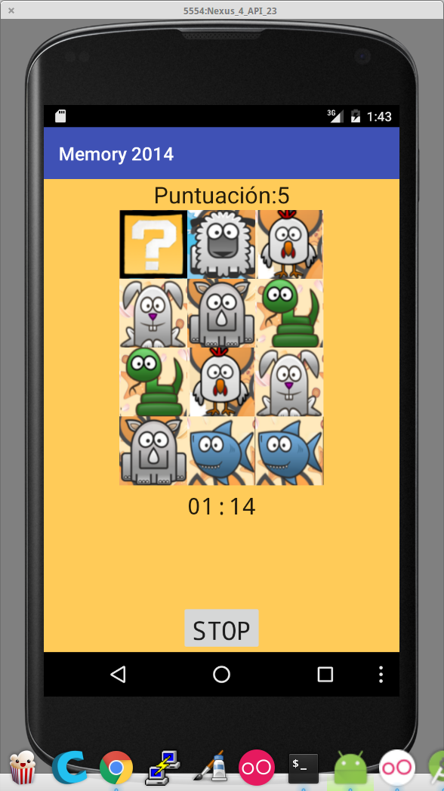

# Proyecto 1: Calculadora

Vamos a comenzar diseñando el interfaz de una calculadora como la siguiente

# Analizando

En primer lugar vamos a analizar los tipos de controles que usaremos:

* Una caja de texto, donde el usuario podrá leer los números. No es necesario que el usuario pueda editar los contenidos.

* Un conjunto de botones con los escribiremos los números y con los que indicamos las operaciones a realizar.

Viendo la disposición de los botones podemos pensar que lo más adecuado es usar una disposición tabular. Eso lo podemos conseguir con el TableLayout

# Layout:

Una Layout es una forma de disponer los controles. Existe diferentes tipos:

* FrameLayout
* AbsoluteLayout
* RelatveLayout
* LinearLayout
* TableLayout

## TableLayout

Está constituido por filas que contienen otros elementos. Dentro de ellas los controles se colocan unos a continuación de los otros

# Estilos

Dado que son muchos los botones que vamos a utilizar y casi todos tienen un aspecto muy similar, definiremos un estilo que aplicaremos a todos. De esta manera cualquier cambio que queramos hacer se aplicará a todos.

Como extraer un estilo
Herencia en los estilos

Vamos a comenzar dando el aspecto que queramos al botón

Las propiedades siempre se nombra con la parte del control al que se aplican y luego con la propiedad: 

TextSize 
TextColor
Background (comentar el uso de imágenes para hacer botonoes de distintas formas)
TextAlignment
Margenes
¿Border?

* Extraemos el estilo

* Creamos tablelayout y lo colocamos (con márgenes)

* Añadimos un tablerow y le añadimos el botón

* Explicar que mejor añadir al Arbol de controles

* Copiamos y pegamos otros 3 botones

* Usamos weight para que se repartan el espacio

* Revisamos el xml del layout para evitar propiedades innecesarias

# Diseño de aplicación de juego Memory

Pantalla inicial

Pantalla del juego

Parece más fácil usar un Tablelayout para las casillas

* Jugaremos con la visibilidad de algunos elementos

	 btStop.setVisibility(View.VISIBLE);

* Usaremos el acceso a recursos como imagen

	ivCartaSegunda.setImageResource(R.drawable.Interrogacion);

* Utilizaremos sonidos para reforzar la interacción	

