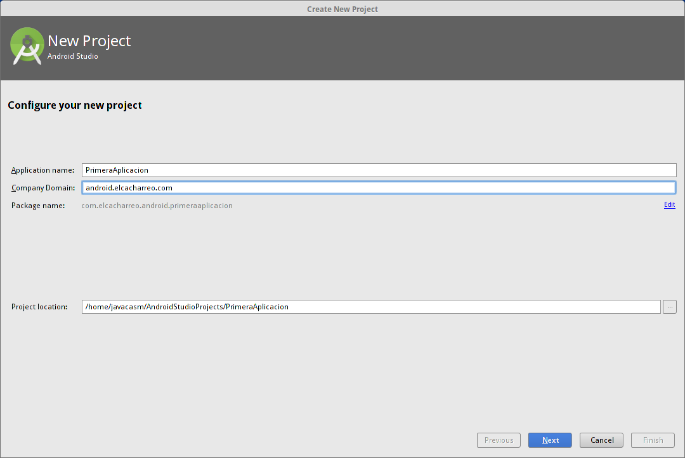

# Creando la primera aplicación

Siguiendo el asistente vamos a ir viendo algunos de los pricipales componentes de Android

* package es una forma de path una manera de identificar de manera única a una aplicación dada
* Activity=pantalla. En el pasado pantalla=funcionalidad.
	* Nos conecta el diseño xml con el código java
	* El asistente tiene varios tipos diferentes (introducción a los distintos tipos de interfaces)

1. Pulsamos la opción de crear una nueva aplicación

2. Seleccionamos la arquitectura a la que irá destinada nuestra aplicación, que pueden ser móviles, tablets, TVs, relojes, ...

Cada plataforma tendrá una aplicación distinta, aunque comparten código y recursos

En este momento vamos a seleccionar sólo a opción de hacer crear una aplicación para móviles y tablets.

3. Vamos a dar nombre a la aplicación para lo que tendremos que dar un título que será el que vea el usuario que luego la instale, ** Application Name ** y un ** Package Name ** que es el identificador único de la aplicación que la identifica entre los millones de aplicaciones que existen.

Es importante elegir bien este identificar puesto que es el que se ha de mantener a lo largo de toda la vida de la aplicación. El  ** Application Name ** puede modificarse pero el ** Package Name ** no.

