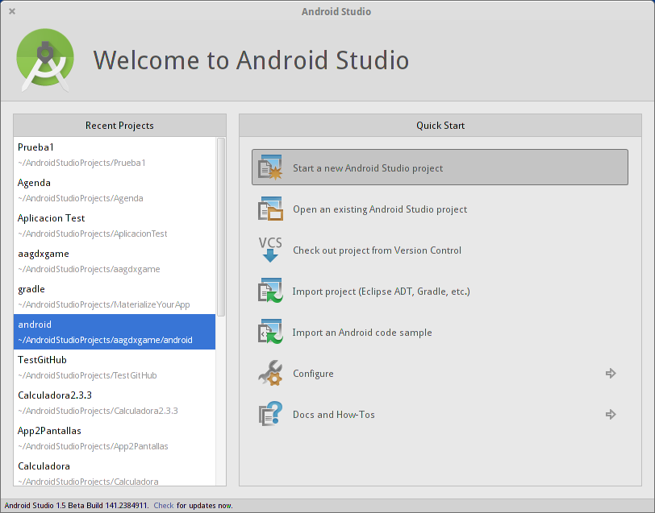
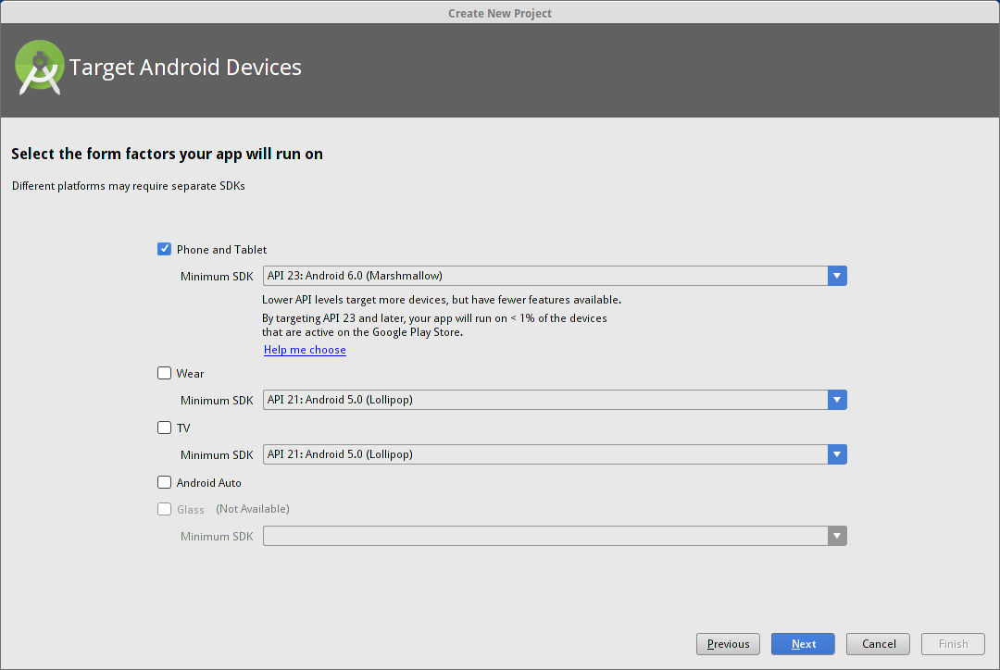

# Creando la primera aplicación

Siguiendo el asistente vamos a ir viendo algunos de los pricipales componentes de Android

* package es una forma de path una manera de identificar de manera única a una aplicación dada
* Activity=pantalla. En el pasado pantalla=funcionalidad.
	* Nos conecta el diseño xml con el código java
	* El asistente tiene varios tipos diferentes (introducción a los distintos tipos de interfaces)

1. Pulsamos la opción de crear una nueva aplicación

2. Seleccionamos la arquitectura a la que irá destinada nuestra aplicación, que pueden ser móviles, tablets, TVs, relojes, ...

Cada plataforma tendrá una aplicación distinta, aunque comparten código y recursos

En este momento vamos a seleccionar sólo a opción de hacer crear una aplicación para móviles y tablets.

