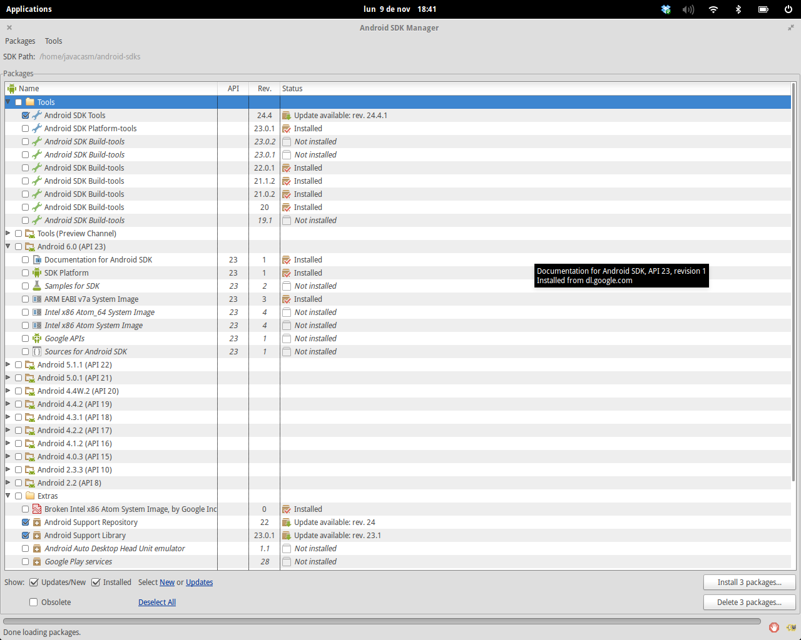

# Procedimiento de instalación de Android Studio

## [Características mínimas del equipo](./requisitos.md)

## Prerequisitos

Para instalar Android Studio necesitamos intalar primero el entorno de desarrollo de Java (JDK) en su versión 7

No es suficiente con tener instalado el entorno de ejecución de Java (JRE)

### ¿Tengo Java?

Puedes ver la versión que tienes instalada con 

	javac -version

Dependiendo de la versión del sistema operativo instalado instalaremos el JDK de 32 o 64 bits 

## SDK de Android

El SDK de Android es el conjunto de librerías, documentación (también ejemplos), código e imágenes de emuladores necesario para poder desarrollar aplicaciones específicas para una versión dada.

Existe un SDK por cada una de las versiones de Android.

## Gestor de actualizaciones

Se requieren:
* Al menos una de las building Tools (mejor la última)
* Platform tools
* Al menos necesitamos una de las [versiones](./Android FAQ.md#versiones) con los sigueintes componentes obligatorios:
	* SDK Platform
	* Una imagen de emulador
Componentes recomendados:
	* Ejemplos (samples)
	* Documentación
